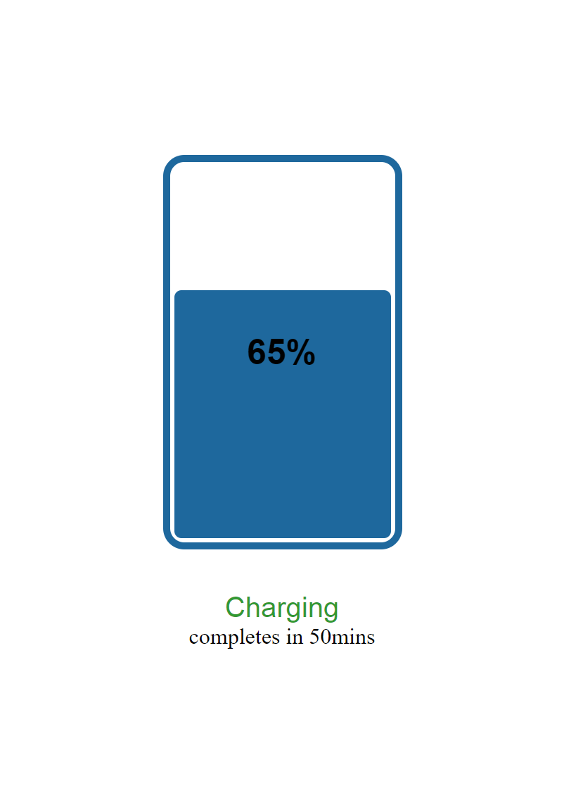
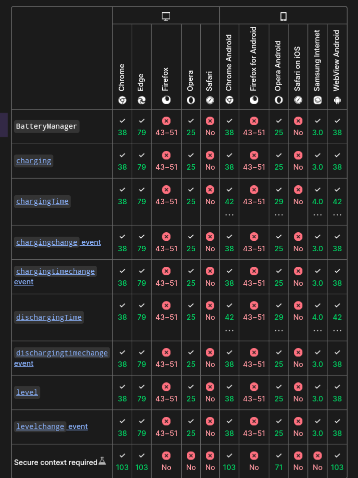

# battery-api
A demo app to use battery api by imitating how electronic battery works, by making dynamic percentage update, height level update, charging status update and warning when battery goes below 15 percent
### Features
* Dynamic battery height display
* Charging status
* warning when battery is low
* display percentage digit
### uncompleted features
* charge completion time
* and discharging time

### Interface

### Browser Compatibility
here are the list browsers that support and dose not support the api

